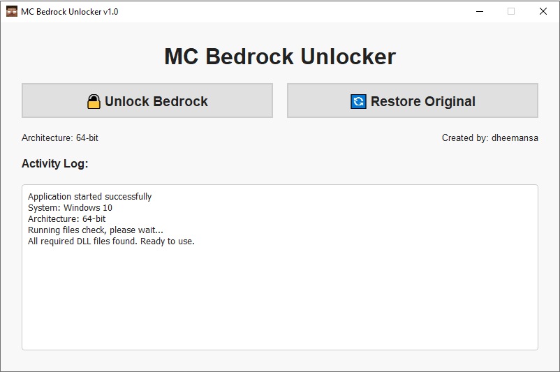

<h1> MC Bedrock Unlocker</h1>


<p align="center">
  
</p>

> [!IMPORTANT]   
> # DISCLAIMER
> - **This project is for educational and proof-of-concept purposes only.** 
>- The developer does not endorse or encourage any illegal activities.
>- Users are solely responsible for complying with all applicable laws and software licenses.
>- This tool modifies core Windows system files, which may violate Microsoft's Terms of Service.
>- Use this software at your own risk. The developer is not responsible for any damage to your system.

## Background

This application automates a manual process for unlocking Minecraft Bedrock Edition features, as demonstrated in a YouTube video by the [SSG channel](https://www.youtube.com/watch?v=6T-Yy4iEBMk).

The custom DLL files used in this project are from untrusted sources. Their safety and legitimacy cannot be guaranteed. This tool is designed to automate the file replacement process without requiring external dependencies like IObit Unlocker.


## System Requirements

- **Operating System:** Windows 10/11
- **Python:** 3.13+ (for building from source)
- **Libraries:** PyQt5, PyInstaller (for building from source)

## Installation & Usage

1. Download the latest release from the [Releases](https://github.com/dheemansa/MC-Bedrock-Unlock/releases) page.
2. Extract the contents of the .zip file.
3. Run the executable file.

## Building from Source


> [!CAUTION]
> Only proceed if you have experience with building software from source.

1. **Install Python:** Version 3.13 or newer.
2. **Clone the repository:**
   ```bash
   git clone https://github.com/dheemansa/MC-Bedrock-Unlock
   cd MC-Bedrock-Unlock
   ```
3. **Install dependencies:**
   ```bash
   pip install -r requirements.txt
   ```
4. **Build the executable:**
   ```bash
   pyinstaller main.spec
   ```

## ⚙️ How It Works

<details>
<summary>Click to expand</summary>

### Unlock Process
1. **File Detection**: Identifies the target system DLL files based on the system architecture.
2. **Backup Creation**: Creates a `.backup` of the original system DLLs.
3. **Ownership Transfer**: Uses the `takeown` command to gain ownership of the files.
4. **Permission Modification**: Uses the `icacls` command to grant full administrator access.
5. **File Replacement**: Deletes the original files and replaces them with the custom DLLs.
6. **Verification**: Confirms that the file replacement was successful.

### Restore Process
1. **SFC Execution**: Runs the `sfc /scannow` command.
2. **System Verification**: Windows verifies the integrity of system files and restores the modified files to their original versions.

</details>

## Target Files

The application modifies the following Windows system files:

**32-bit Systems:**
- `C:\Windows\System32\Windows.ApplicationModel.Store.dll`

**64-bit Systems:**
- `C:\Windows\System32\Windows.ApplicationModel.Store.dll`
- `C:\Windows\SysWOW64\Windows.ApplicationModel.Store.dll`

## Security Warnings

- **System File Modification**: This tool alters critical Windows system files.
- **Unknown DLL Sources**: The custom DLLs are from untrusted sources.
- **Potential Risks**: This may lead to system instability or security vulnerabilities.
- **Backup Recommended**: It is highly recommended to create a system restore point before using this tool.
- **Antivirus Detection**: This tool may be flagged as potentially unwanted software by antivirus programs.

## Legal Considerations

- Modifying system files may be a violation of Microsoft's Terms of Service.
- Using modified DLLs to bypass software restrictions may violate software licenses.
- Users are solely responsible for ensuring legal compliance in their jurisdiction.
- This tool is provided "AS-IS" without any warranties.

## Technical Implementation

- **Language**: Python 3.13+
- **GUI Framework**: PyQt5

## Troubleshooting

- **Access Denied**: Ensure the application is run with administrator privileges.
- **SFC Fails**: Try running `sfc /scannow` in an elevated Command Prompt or PowerShell.


## Submitting Issues

If you encounter any bugs or issues, please submit a detailed report on the [Issues](https://github.com/dheemansa/MC-Bedrock-Unlock/issues) page. To help us resolve the issue quickly, please include the following information:

- **A clear and descriptive title.**
- **A detailed description of the problem.**
- **Steps to reproduce the issue (if known).**
- **The expected behavior and what you observed instead.**
- **Log files:** Please include the contents of the `logs` folder, which is generated by the application. This is crucial for debugging.

## Contributing

This is a proof-of-concept project. Contributions that focus on improving code quality and safety are welcome.

## Credits

- The original process was demonstrated by the [SSG YouTube channel](https://www.youtube.com/watch?v=6T-Yy4iEBMk).
- The custom DLL files were sourced from various online communities.

## License

This project is provided for educational purposes only. Users assume all responsibility for its use.

---

**Remember: This tool modifies critical system files. Use with extreme caution and only if you fully understand the risks involved.**
